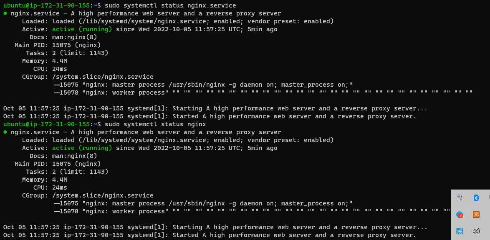
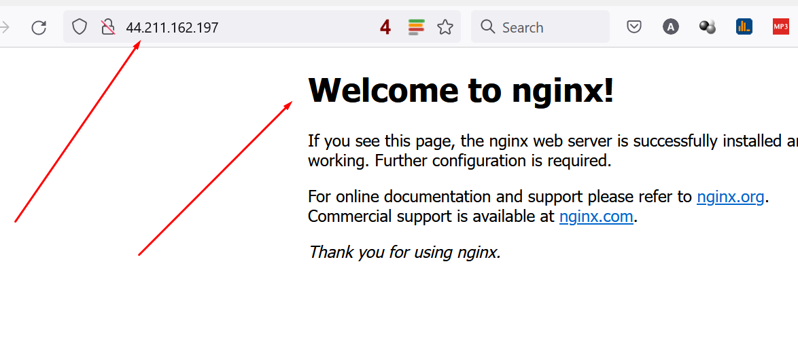
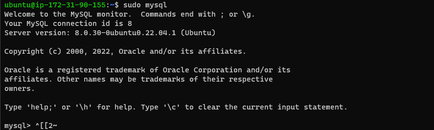
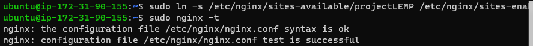

# Project 02

___

PROJECT 2:LEMP STACK IMPLEMENTATION

installing ngnix web server.

`sudo apt update`

`sudo apt install nginx`

`sudo systemctl status nginx`

___

Installing MySQL

`sudo apt install mysql-server`

`sudo mysql`

`sudo mysql -p`

___

Installing PHP

`sudo apt install php-fmp php-mysql`
___

Configuring Nginx to Use PHP Processor

___

`sudo mkdir /var/www/projectLEMP`

`sudo chown -R $ubuntu:$ubuntu /var/www/projectLEMP`

`sudo nano /etc/nginx/sites-available/projectLEMP`

`sudo ln -s /etc/nginx/sites-available/projectLEMP /etc/nginx/sites-enabled/`

`sudo nginx -t`

 /